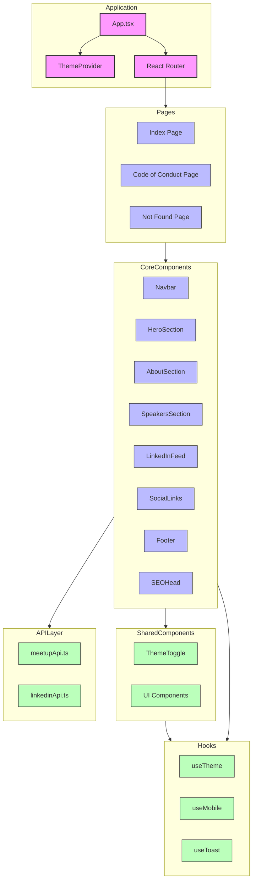

# Abstract Codebase Overview

```mermaid
flowchart TB
  subgraph Application
    App["App.tsx"]
    ThemeProvider["ThemeProvider"]
    Router["React Router"]
  end

  subgraph Pages
    Index["Index Page"]
    CodeOfConduct["Code of Conduct Page"]
    NotFound["Not Found Page"]
  end

  subgraph CoreComponents
    Navbar["Navbar"]
    HeroSection["HeroSection"]
    AboutSection["AboutSection"]
    SpeakersSection["SpeakersSection"]
    LinkedInFeed["LinkedInFeed"]
    SocialLinks["SocialLinks"]
    Footer["Footer"]
    SEOHead["SEOHead"]
  end

  subgraph SharedComponents
    ThemeToggle["ThemeToggle"]
    UIComponents["UI Components"]
  end

  subgraph APILayer
    MeetupAPI["meetupApi.ts"]
    LinkedInAPI["linkedinApi.ts"]
  end

  subgraph Hooks
    UseTheme["useTheme"]
    UseMobile["useMobile"]
    UseToast["useToast"]
  end

  App --> Router
  App --> ThemeProvider
  Router --> Pages
  Pages --> CoreComponents
  CoreComponents --> SharedComponents
  CoreComponents --> APILayer
  SharedComponents --> Hooks
  CoreComponents --> Hooks
  
  classDef primary fill:#f9f,stroke:#333,stroke-width:2px;
  classDef secondary fill:#bbf,stroke:#333,stroke-width:1px;
  classDef tertiary fill:#bfb,stroke:#333,stroke-width:1px;
  
  class App,Router,ThemeProvider primary;
  class Index,CodeOfConduct,NotFound secondary;
  class Navbar,HeroSection,AboutSection,SpeakersSection,LinkedInFeed,SocialLinks,Footer,SEOHead secondary;
  class UIComponents,ThemeToggle tertiary;
  class MeetupAPI,LinkedInAPI tertiary;
  class UseTheme,UseMobile,UseToast tertiary;
``` 