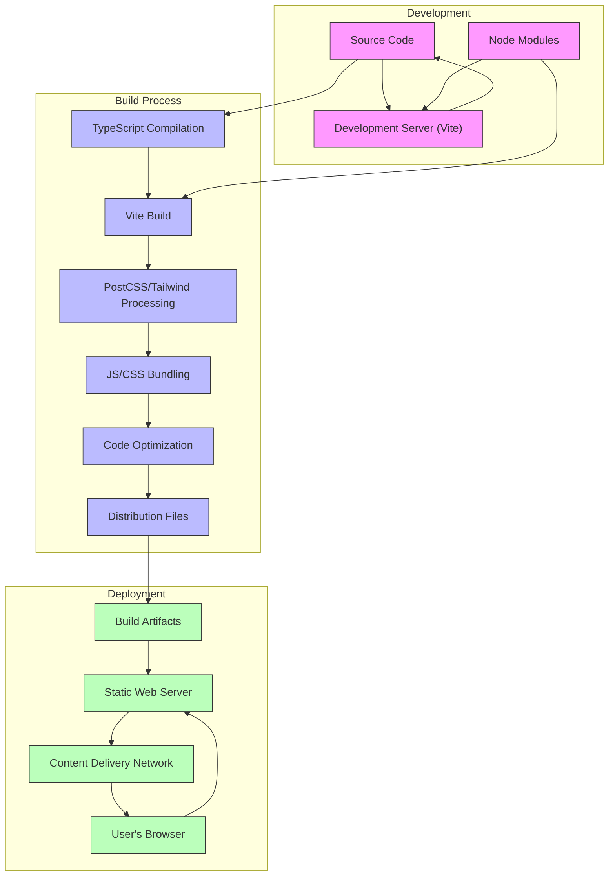

# Build and Deployment Flow

```mermaid
flowchart TB
    subgraph "Development"
        SourceCode["Source Code"]
        NodeModules["Node Modules"]
        DevServer["Development Server (Vite)"]
    end
    
    subgraph "Build Process"
        TsCompile["TypeScript Compilation"]
        ViteBuild["Vite Build"]
        PostCss["PostCSS/Tailwind Processing"]
        Bundle["JS/CSS Bundling"]
        Optimize["Code Optimization"]
        Output["Distribution Files"]
    end
    
    subgraph "Deployment"
        Build["Build Artifacts"]
        StaticServer["Static Web Server"]
        CDN["Content Delivery Network"]
        Browser["User's Browser"]
    end
    
    SourceCode --> DevServer
    NodeModules --> DevServer
    DevServer --> SourceCode
    
    SourceCode --> TsCompile
    TsCompile --> ViteBuild
    NodeModules --> ViteBuild
    ViteBuild --> PostCss
    PostCss --> Bundle
    Bundle --> Optimize
    Optimize --> Output
    
    Output --> Build
    Build --> StaticServer
    StaticServer --> CDN
    CDN --> Browser
    Browser --> StaticServer
    
    classDef development fill:#f9f,stroke:#333,stroke-width:1px;
    classDef build fill:#bbf,stroke:#333,stroke-width:1px;
    classDef deployment fill:#bfb,stroke:#333,stroke-width:1px;
    
    class SourceCode,NodeModules,DevServer development;
    class TsCompile,ViteBuild,PostCss,Bundle,Optimize,Output build;
    class Build,StaticServer,CDN,Browser deployment;
``` 