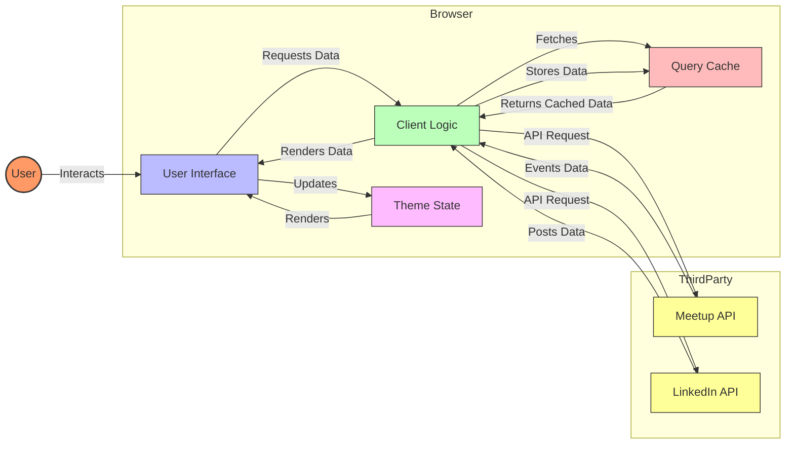

# Data Flow Diagram

```mermaid
flowchart LR
    User((User))
    
    subgraph Browser
        UI[User Interface]
        CL[Client Logic]
        Theme[Theme State]
        Cache[Query Cache]
    end
    
    subgraph ThirdParty
        MeetupAPI[Meetup API]
        LinkedInAPI[LinkedIn API]
    end
    
    User -->|Interacts| UI
    UI -->|Updates| Theme
    Theme -->|Renders| UI
    
    UI -->|Requests Data| CL
    CL -->|Fetches| Cache
    Cache -->|Returns Cached Data| CL
    CL -->|Renders Data| UI
    
    CL -->|API Request| MeetupAPI
    MeetupAPI -->|Events Data| CL
    
    CL -->|API Request| LinkedInAPI
    LinkedInAPI -->|Posts Data| CL
    
    CL -->|Stores Data| Cache
    
    style User fill:#f96,stroke:#333,stroke-width:2px
    style UI fill:#bbf,stroke:#333,stroke-width:1px
    style CL fill:#bfb,stroke:#333,stroke-width:1px
    style Theme fill:#fbf,stroke:#333,stroke-width:1px
    style Cache fill:#fbb,stroke:#333,stroke-width:1px
    style MeetupAPI fill:#ff9,stroke:#333,stroke-width:1px
    style LinkedInAPI fill:#ff9,stroke:#333,stroke-width:1px
``` 