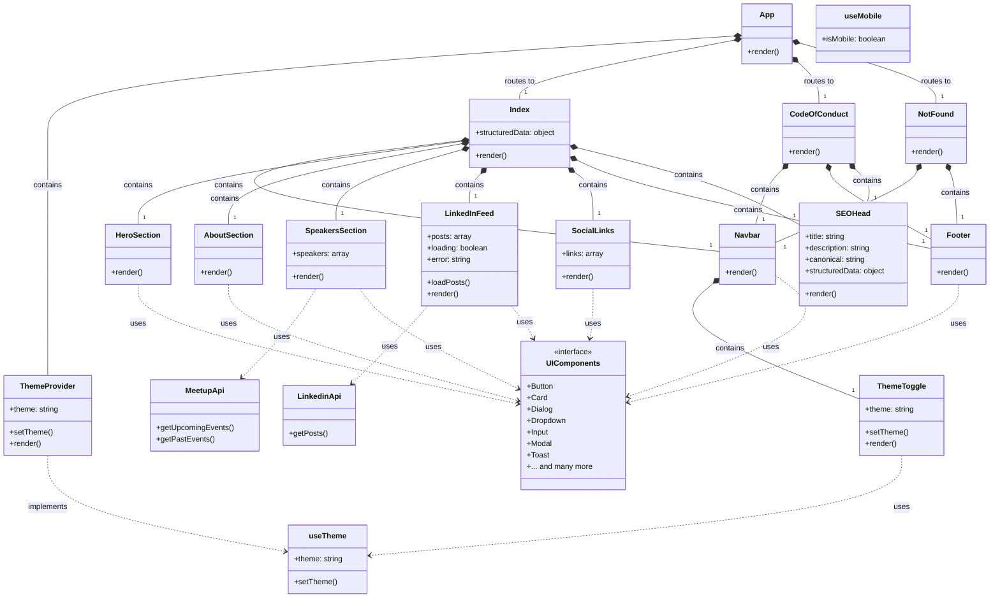

# Detailed Component Diagram

```mermaid
classDiagram
    class App {
        +render()
    }
    
    class ThemeProvider {
        +theme: string
        +setTheme()
        +render()
    }
    
    class Navbar {
        +render()
    }
    
    class Index {
        +structuredData: object
        +render()
    }
    
    class CodeOfConduct {
        +render()
    }
    
    class NotFound {
        +render()
    }
    
    class HeroSection {
        +render()
    }
    
    class AboutSection {
        +render()
    }
    
    class SpeakersSection {
        +speakers: array
        +render()
    }
    
    class LinkedInFeed {
        +posts: array
        +loading: boolean
        +error: string
        +loadPosts()
        +render()
    }
    
    class SocialLinks {
        +links: array
        +render()
    }
    
    class Footer {
        +render()
    }
    
    class SEOHead {
        +title: string
        +description: string
        +canonical: string
        +structuredData: object
        +render()
    }
    
    class ThemeToggle {
        +theme: string
        +setTheme()
        +render()
    }
    
    class MeetupApi {
        +getUpcomingEvents()
        +getPastEvents()
    }
    
    class LinkedinApi {
        +getPosts()
    }
    
    class useTheme {
        +theme: string
        +setTheme()
    }
    
    class useMobile {
        +isMobile: boolean
    }
    
    class UIComponents {
        <<interface>>
        +Button
        +Card
        +Dialog
        +Dropdown
        +Input
        +Modal
        +Toast
        +... and many more
    }
    
    App *-- ThemeProvider : contains
    App *-- "1" Index : routes to
    App *-- "1" CodeOfConduct : routes to
    App *-- "1" NotFound : routes to
    
    Index *-- "1" Navbar : contains
    Index *-- "1" HeroSection : contains
    Index *-- "1" AboutSection : contains
    Index *-- "1" SpeakersSection : contains
    Index *-- "1" LinkedInFeed : contains
    Index *-- "1" SocialLinks : contains
    Index *-- "1" Footer : contains
    Index *-- "1" SEOHead : contains
    
    CodeOfConduct *-- "1" Navbar : contains
    CodeOfConduct *-- "1" Footer : contains
    CodeOfConduct *-- "1" SEOHead : contains
    
    NotFound *-- "1" Navbar : contains
    NotFound *-- "1" Footer : contains
    
    Navbar *-- "1" ThemeToggle : contains
    
    ThemeToggle ..> useTheme : uses
    LinkedInFeed ..> LinkedinApi : uses
    SpeakersSection ..> MeetupApi : uses
    
    Navbar ..> UIComponents : uses
    HeroSection ..> UIComponents : uses
    AboutSection ..> UIComponents : uses
    SpeakersSection ..> UIComponents : uses
    LinkedInFeed ..> UIComponents : uses
    SocialLinks ..> UIComponents : uses
    Footer ..> UIComponents : uses
    
    ThemeProvider ..> useTheme : implements
``` 