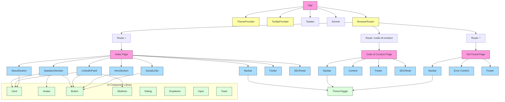

# UI Component Hierarchy

```mermaid
graph TD
    App[App]
    
    App --> ThemeProvider
    App --> TooltipProvider
    App --> Toaster
    App --> Sonner
    App --> Router[BrowserRouter]
    
    Router --> IndexRoute[Route: /]
    Router --> CodeOfConductRoute[Route: /code-of-conduct]
    Router --> NotFoundRoute[Route: *]
    
    IndexRoute --> IndexPage[Index Page]
    CodeOfConductRoute --> CodeOfConductPage[Code of Conduct Page]
    NotFoundRoute --> NotFoundPage[Not Found Page]
    
    IndexPage --> NavbarIndex[Navbar]
    IndexPage --> HeroSection
    IndexPage --> AboutSection
    IndexPage --> SpeakersSection
    IndexPage --> LinkedInFeed
    IndexPage --> SocialLinks
    IndexPage --> FooterIndex[Footer]
    IndexPage --> SEOHeadIndex[SEOHead]
    
    CodeOfConductPage --> NavbarCoC[Navbar]
    CodeOfConductPage --> Content[Content]
    CodeOfConductPage --> FooterCoC[Footer]
    CodeOfConductPage --> SEOHeadCoC[SEOHead]
    
    NotFoundPage --> NavbarNF[Navbar]
    NotFoundPage --> ErrorContent[Error Content]
    NotFoundPage --> FooterNF[Footer]
    
    NavbarIndex --> ThemeToggle
    NavbarCoC --> ThemeToggle
    NavbarNF --> ThemeToggle
    
    SpeakersSection --> Card
    SpeakersSection --> Avatar
    SpeakersSection --> Button
    
    LinkedInFeed --> Skeleton
    LinkedInFeed --> Card
    LinkedInFeed --> Button
    
    HeroSection --> Button
    AboutSection --> Card
    SocialLinks --> Button
    
    subgraph "UI Component Library"
        Button
        Card
        Dialog
        Dropdown
        Input
        Avatar
        Skeleton
        Toast
    end
    
    classDef page fill:#f9d,stroke:#333,stroke-width:1px;
    classDef component fill:#adf,stroke:#333,stroke-width:1px;
    classDef provider fill:#ffa,stroke:#333,stroke-width:1px;
    classDef ui fill:#dfd,stroke:#333,stroke-width:1px;
    
    class App,IndexPage,CodeOfConductPage,NotFoundPage page;
    class NavbarIndex,NavbarCoC,NavbarNF,HeroSection,AboutSection,SpeakersSection,LinkedInFeed,SocialLinks,FooterIndex,FooterCoC,FooterNF,SEOHeadIndex,SEOHeadCoC,Content,ErrorContent component;
    class ThemeProvider,TooltipProvider,Router provider;
    class Button,Card,Dialog,Dropdown,Input,Avatar,Skeleton,Toast,ThemeToggle ui;
``` 